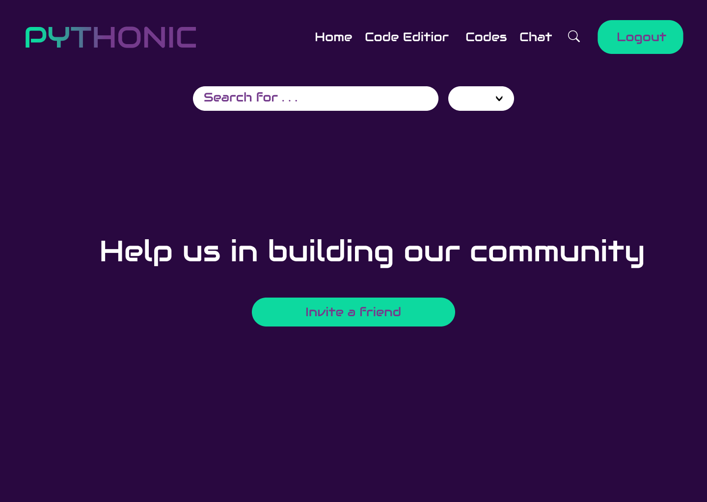

<h1 align="center">Code Editor</h1>
<h3 align="center">An interactive code editor using Laravel and React. The platform allows users to navigate a landing page, login to their accounts, write Python code, and compile it. Users can also search for other developers on the system and save their source codes on the server. They can also download their saved source codes and chat with other developers on the system. The platform also includes an admin panel where admins can view all users in the system. Authentication and middleware classes are applied for security purposes</h3> 
<h3 align="left">Languages and Tools:</h3> 

 
&nbsp&nbsp&nbsp&nbsp
 &nbsp&nbsp&nbsp&nbsp
   &nbsp&nbsp&nbsp&nbsp
  &nbsp&nbsp&nbsp&nbsp
   &nbsp&nbsp&nbsp&nbsp
     </a> &nbsp&nbsp&nbsp&nbsp
 </a>
 
 

- 👨‍💻 Authors: Hassan Zein Al-Deen, Mhammad Atout, Mhammad Karim, Sana Al Rayess

- 📫 How to reach out to  **@gmail.com**

- 📫 How to reach out to  **@gmail.com**

- 📫 How to reach out to  **@gmail.com**

- 📫 How to reach out to Sana Al Rayess **rayess.sana@gmail.com**

- 🌱 Date: 28-March-2023

- 📝 References used in the project:

- <ul><li><a href="https://youtu.be/mxHoPYFsTuk">Web Dev Simplified</a>
  </li>
  <li><a href="https://youtu.be/Iy7oFI76FpE" >Abdelrahman Gamal</a></li>
  <li><a href="https://youtu.be/JttTcnidSdQ">Traversy Media</a></li>
  </ul> 

<h1 align="left">User Stories</h1>
<ul>
<li>As a registered user, I want to be able to log in to my account using my email address and password, so that I can access my saved source codes and other features of the platform.</li>
<li>As a user, I want to be able to write Python code in the editor and see the results of its compilation or execution, so that I can test and refine my programs.</li>
<li>As a user, I want to be able to save my source codes on the server and retrieve them later, so that I can work on them from different devices or locations.</li>
<li>As a user, I want to be able to download my saved source codes, so that I can share them with others or use them offline.</li>
<li>As a user, I want to be able to send messages to other developers on the system and receive messages from them, so that I can communicate with them about our projects or ask for help.</li>
<li>As an admin, I want to be able to view a list of all users in the system and their basic information, so that I can monitor the user base of the platform.</li>
  

<h1 align="left">Color Palette:</h1> 
  

<h1 align="left">Wireframes:</h1> 

| Home page | Login | SignUp |
| --- | --- | --- |
|  |  |  |

| Search | Chat | Editor |
| --- | --- | --- |
|  |  |  |

| Admin Panel |
| --- | --- | --- |
|  |

 

<h1 align="left">Mockups:</h1> 

| Home page | Login | SignUp |
| --- | --- | --- |
|  |  |  |

| Search | Chat | Editor |
| --- | --- | --- |
|  |  |  |

 

<h1 align="left">Implementation</h1> 

| Home page | Login | SignUp |
| --- | --- | --- |
|  |  |  |

| Search | Chat | Editor |
| --- | --- | --- |
|  |  |  |

 

